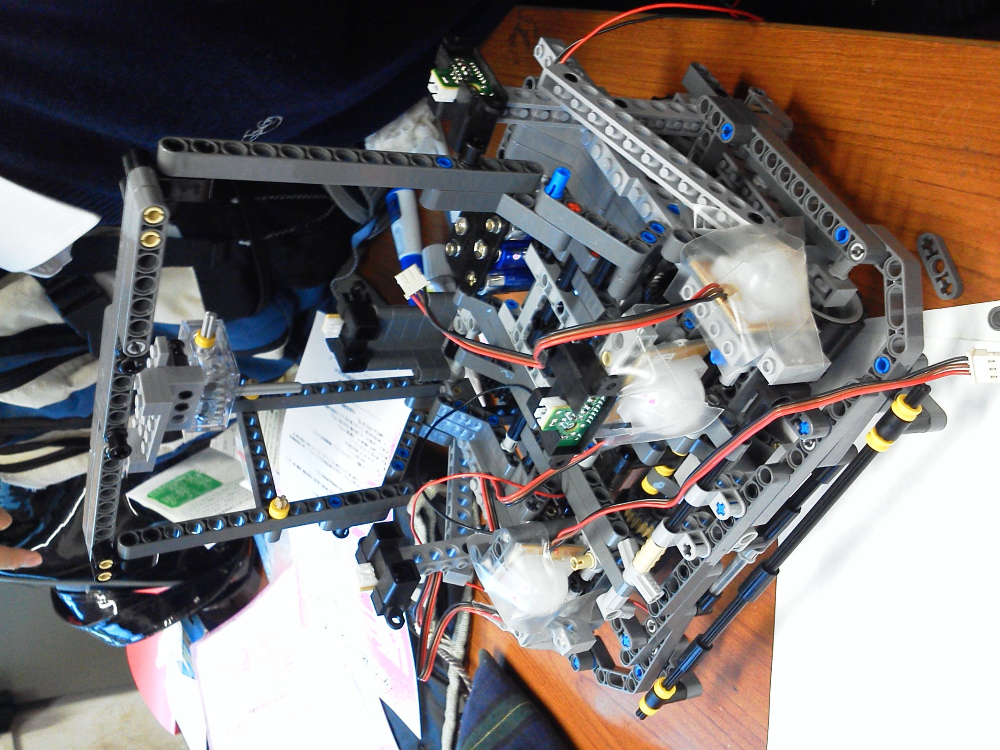
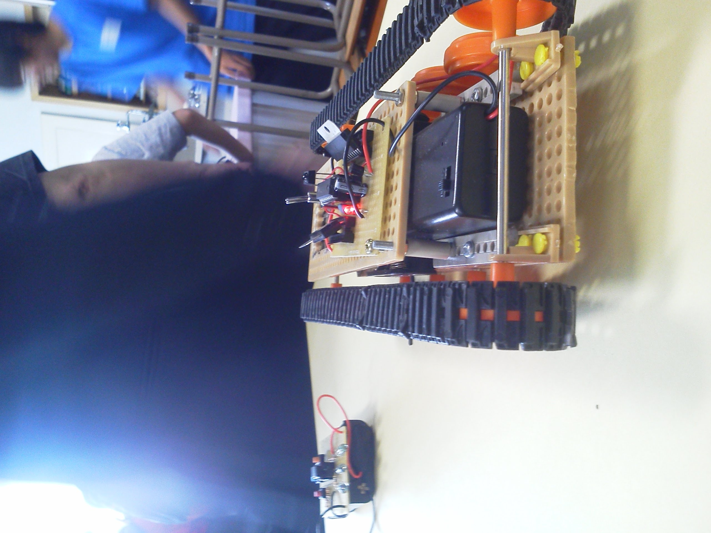

<!---
  参考URL（https://jason718.github.io/project/privacy/main.html）
-->
<link rel="StyleSheet" href="./style.css" type="text/css" media="all">

# Taichi Nakamura portfolio

## SNS
**[Qiita](https://qiita.com/IntenF) [Youtube](https://www.youtube.com/channel/UCZTpRG2dGTNGmW_vOifaCLg) [Twitter](https://twitter.com/Inten_futosi) [Github](https://github.com/IntenF)**

## 略歴
- 2014 栄光学園高等学校 卒業
- 2018 慶應義塾大学理工学部 卒業
- 2018 慶應義塾大学大学院開放環境科学専攻
- 2020 NRI

## インターン歴
- 2018/3-2018/8 SENSY株式会社
- 2018/8 野村総合研究所
- 2019/2-2019/5 PKSHA株式会社

## 保有資格
- 2015/05 [基本情報技術者](doc/基本情報技術者試験合格証明書.pdf)
- 2017/06 [エンベデッドシステムスペシャリスト](doc/エンベデッドスペシャリスト合格証明書.pdf)
- 2018/08 TOEIC 675
- 2020/08 [AWS Cloud Practitioner](doc/AWS Certified Cloud Practitioner certificate.pdf)
- 2020/09 [Oracle Master Bronze](https://www.youracclaim.com/badges/a793f2c0-f549-4b81-982e-43c6cac0e40b/public_url)
- 2020/11 [AWS Solution Architect](doc/AWS Certified Solutions Architect - Associate certificate.pdf)
- 2021/06 [TOEIC 765](img/20210620_TOEIC_765.jpg)
- 2021/09 [E資格試験](doc/e_shikaku.txt)

## 得意分野
- 機械学習
- 線形代数
- 信号処理
- 匿名加工研究
- 組み込み系
- 動画編集
- 写真撮影
- プログラミング（アセンブリ言語、C/C++、Python、javascript）

他にも研究室のサーバを管理したり，自宅サーバ作ったり，ゲート式量子コンピュータなど手広くやってまーす．

## 論文
### TMk-Anonymity: Perturbation-Based Data Anonymization Method for Improving Effectiveness of Secondary Use
ノイズ付加による個人情報の匿名化についての研究.NTT の開発した従来手法よりも 100 倍程度ノイズ の付加を小さくいても同等の匿名性がある手法を開発した.

- [IEEE Xplore](https://ieeexplore.ieee.org/document/8592838)

### Face Image Anonymization as an Application of Multidimensional Data K-Anonymizer
StyleGANを利用した顔画像K匿名化についての研究。ニューラルネットなどの機械学習を匿名化に応用するアーキテクチャ"MIKU"を提案し、StyleGANの潜在空間上で顔画像を平均化することでビットマップ上で平均値を取るのに比べ人間の認識上の平均の顔に近い顔の生成に成功した。

 - [IEEE Xplore](https://ieeexplore.ieee.org/document/8951681)
 - [Journal](http://ijnc.org/index.php/ijnc/article/view/244)

 <iframe width="560" height="420" src="https://www.youtube.com/embed/v5a1_37su28" title="YouTube video player" frameborder="0" allow="accelerometer; autoplay; clipboard-write; encrypted-media; gyroscope; picture-in-picture" allowfullscreen></iframe>

### Quantum self-learning Monte Carlo with quantum Fourier transform sampler
適応的サンプリングを応用して高速にシミュレートした量子コンピュータとメトロポリスヘイスティングス法を用いて高速に任意の乱数をサンプリングする方法について研究した論文。比較対象とした一様分布の乱数生成に比べて目標分布の乱数を2倍程度効率良くサンプリングすることに成功した。

- [arxiv](https://arxiv.org/abs/2005.14075)
- [Journal](https://journals.aps.org/prresearch/abstract/10.1103/PhysRevResearch.2.043442)

## 作品 実績 コンテスト参加等

### IPA 未踏ターゲット事業　ゲート式量子コンピュータ
「ゲート式量子コンピュータと機械学習による高速モンテカルロ計算」で採択された．ゲート式量子コンピュータを使って，モンテカルロ計算に使う乱数の生成を機械学習と併用することで高速化させるプロジェクト．2018/11-2020/2まで行った．

- [arxiv](https://arxiv.org/abs/2005.14075)
- [IPA採択者一覧](https://www.ipa.go.jp/jinzai/target/2018/koubokekka2_index.html)

### ごみApp　JPHACK2018
ゴミ箱の場所がわかるサービスを実装．代表としてハッカソンに参加．ハッカソン初参加で東京地区を勝ち抜き，ファイナリストとして戦った．

<iframe width="560" height="420" src="https://www.youtube.com/embed/nn_b1aQscYc" frameborder="0" allow="accelerometer; autoplay; encrypted-media; gyroscope; picture-in-picture" allowfullscreen></iframe>

### WandFul
指揮棒に３軸加速度センサを内装し人の指揮のテンポを検知させることでMIDI音源を自動でその指揮に合わせて流すガジェット．
GUGEN2017に提出し，予選を通過，本選展示も行った作品．

- [GUGEN2017 WandFul](https://gugen.jp/entry2017/2017-102)

<iframe width="560" height="315" src="https://www.youtube.com/embed/6GtuL4mUTX0" frameborder="0" allow="accelerometer; autoplay; encrypted-media; gyroscope; picture-in-picture" allowfullscreen></iframe>

### ミクにリアルで踊っていただいた【実写合成】
初音ミクを学校内で踊らせる実写合成動画をフリーソフトだけを使って作成．方法から１から考えた自身の作品．

<iframe width="560" height="315" src="https://www.youtube.com/embed/YjFwasB_oaU" frameborder="0" allow="accelerometer; autoplay; encrypted-media; gyroscope; picture-in-picture" allowfullscreen></iframe>
<!--- [youtubeリンク](https://youtu.be/YjFwasB_oaU) --->

### うなりってナンジャラホイ？
人間の知覚がDFTであると仮定して，「うなり」の聞こえる理由を突き止めたWEB記事

- [WEB記事リンク](https://kcs1959.jp/archives/1921/research/%25E3%2580%2590%25E9%259F%25B3%25E3%2580%2591%25E3%2581%2586%25E3%2581%25AA%25E3%2582%258A%25E3%2581%25A3%25E3%2581%25A6%25E3%2583%258A%25E3%2583%25B3%25E3%2582%25B8%25E3%2583%25A3%25E3%2583%25A9%25E3%2583%259B%25E3%2582%25A4%25EF%25BC%259F)

### ロボカップジュニア レスキューB
ロボットで，迷路を探索しながら熱源を探す競技．このために四方に温度センサ，距離センサをを配置した自動制御ロボットを自作．

### PICで福島原発のアレっぽいものを作ってみた
PICマイコンを使ったセンサ付きの遠隔操作ロボット．使用言語 C言語

<noscript><a href="https://www.nicovideo.jp/watch/sm16247713">ＰＩＣで福島原発のアレっぽいものを作ってみた</a></noscript>

### 赤外線ラジコン
PICマイコンで作った赤外線ラジコン．使用言語 PICアセンブリ

<!---# -->

